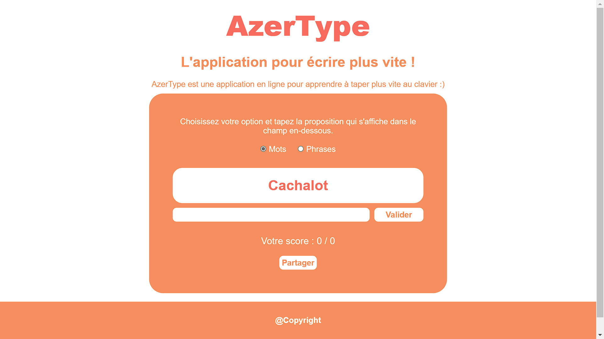

# ⌨️ Appli d'Entraînement au Clavier: AzerType 

Une application web pour s'entraîner à taper plus vite au clavier. L'utilisateur peut choisir entre des **mots** ou des **phrases** à taper, puis l'application lui propose du texte à recopier. À la fin, un **score est généré** en fonction des fautes, et l'utilisateur peut **partager son score par mail**.

## 🌐 Aperçu

🔗 [Voir la démo en ligne](https://ibrahimacissedev.github.io/AzerType/)



## 🛠️ Technologies utilisées

- HTML5  
- CSS3 (Flexbox, design responsive)  
- JavaScript (DOM, événements clavier, calcul de score)

## ✨ Fonctionnalités

- Choix entre deux modes :  
  - 🟢 **Mots** : une série de mots à taper  
  - 🟠 **Phrases** : des phrases complètes à recopier
- Textes prédéfinis et affichés dans un ordre fixe
- Calcul du **score final** basé sur le nombre d'erreurs
- Affichage du texte original et de la saisie utilisateur
- Option de **partager son score par email**
- Interface simple et responsive

## 📦 Installation

1. Clone le dépôt :
   ```bash
   git clone https://github.com/ibrahimaCisse10/AzerType.git

   🎯 Objectifs du projet
Améliorer la vitesse et la précision au clavier

S'entraîner avec un vrai retour sur les erreurs

Travailler l'intégration HTML/CSS/JS dans un projet interactif

## 📫 Me contacter
📧 ibrahimacisse.dev@gmail.com

🔗 [Mon profil GitHub](https://github.com/ibrahimaCisse10)
